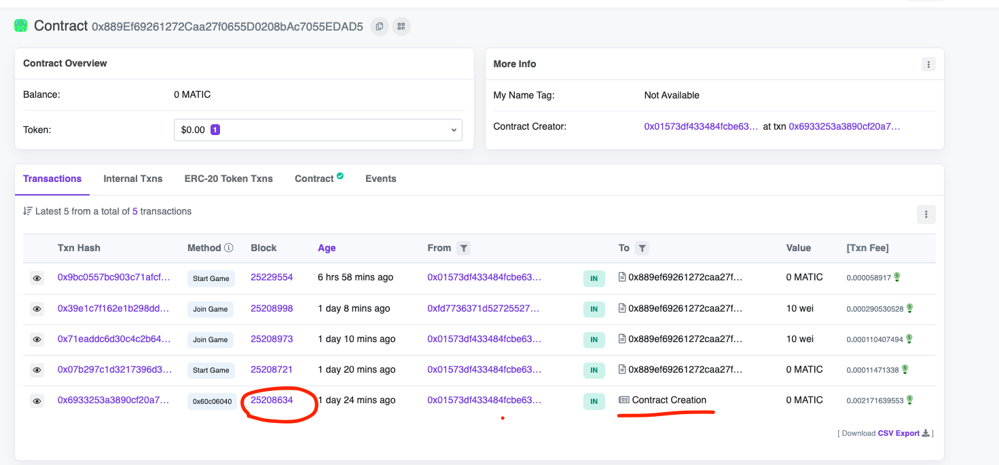

# The Graph

****[**The Graph**](https://thegraph.com/) **is a decentralized query protocol and indexing service for the blockchain.**&#x20;

* It allows developers to easily track events being emitted from smart contracts on various networks
* Write custom data transformation scripts, which are run in real time.&#x20;
* The data is also made available through a simple GraphQL API which developers can then use to display things on their frontends.

### Prerequisites

* We will be using **yarn** which **is a package manager** just **like npm**.
  * **Install yarn from** [**here**](https://classic.yarnpkg.com/lang/en/docs/install/#mac-stable) ****&#x20;
* Watch this 40 minute tutorial on [GraphQL](https://www.youtube.com/watch?v=ZQL7tL2S0oQ)
* **What axios is**
  * Watch this short [tutorial](https://www.youtube.com/watch?v=6LyagkoRWYA)
* You should have completed the [Chainlink VRF tutorial](https://github.com/LearnWeb3DAO/Chainlink-VRFs)

### How it Works

<figure><figcaption></figcaption></figure>

1. **A dApp sends a transaction** and **some data gets stored** in the **smart contract**.&#x20;
2. This **smart contract then emits** one or more **events**.
3. **Graph's node keeps scanning Ethereum** for new blocks and the data for your subgraph that these blocks may contain.
4. **If the node finds an event you were looking for and defined in your subgraph, it runs the data transformation scripts (mappings) you defined**. The mapping is a WASM (Web assembly) module that creates or updates data `Entities` on the Graph Nodes in response to the event.
5. We can query the Graph's node for this data using the [GraphQL Endpoint](https://graphql.org/learn/)

