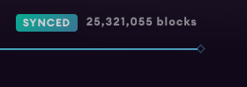

# Verifying on Etherscan

If you open [this](https://etherscan.io/address/0x7be8076f4ea4a4ad08075c2508e481d6c946d12b#writeContract) etherscan link, you can see that you can interact with this smart contract's functions directly through etherscan, similar to how you used to do it on Remix.

<figure><figcaption></figcaption></figure>

Are you wondering why that doesn't happen for your contract?

The reason is that the contract mentioned above is verified on etherscan while yours is not.

### Why?

* Verifying contracts is important because it ensures that the code is exactly what was deployed onto the blockchain.&#x20;
* It also allows the public to read and audit your smart contract code and is a good signal for establishing trust for your dApp.&#x20;
* It also gives you an UI interface to interact with the contracts similar to Remix, where you can call all the functions that exist directly through Etherscan.

### Hardhat Plugin

* Verifying code on Etherscan manually can get quite tricky.&#x20;
* You need to make sure that you not only verify your main contract but also the contracts that you are inheriting or using along with your main contract.&#x20;
* If you deployed your contract for testing and verified it already with the slightest of changes to your contract you will have to again go through the manual process which gets tedious over time.

### Smart Contract

To build the smart contract we would be using [Hardhat](https://hardhat.org/).

**Setup a Hardhat project**

```shell
mkdir etherscan_verification
cd etherscan_verification
npm init --yes
npm install --save-dev hardhat

# bootstrap the hardhat project
npx hardhat

# if not on mac, you need also the below
npm install --save-dev @nomicfoundation/hardhat-toolbox
```

Create**`Verify.sol`**  inside **./contracts**

****


